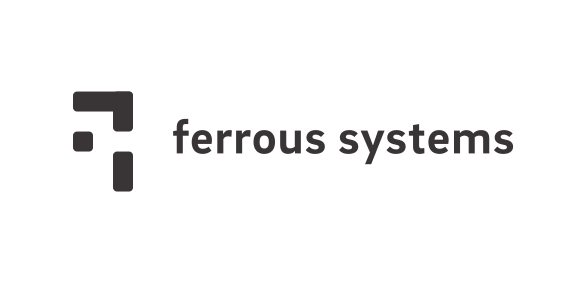

# Advanced Training

[](https://ferrous-systems.com/)

This is the Ferrous Systems advanced embedded training. It is aimed at developers who have already begun working with embedded Rust, but would like to push their knowledge and understanding further. This course focuses around the development of a non-blocking Hardware Abstraction Layer driver for the Nordic nRF52.

This training is based on the [Decawave DWM1001-DEV] development board. It is recommended to have two boards for this training: one for the instructor, and one for each student, however the majority of exercises can be done with a single board used by the student.

This training is intended to take one full day, and is broken into four 1.5 hour segments. These segments are a rough suggestion, some students (and groups) will make it further than the given material, and some will not. For the later segments, "reach goals" are given, to allow students to push their understanding further.

For instructions on preparing your system for the workshop, please see the [Installation Instructions].

For trainer instructions, please see the [Instructor's Guide].

[Decawave DWM1001-DEV]: https://www.decawave.com/product/dwm1001-development-board/
[Instructor's Guide]: ./docs/instructor-guide.md
[Installation Instructions]: ../INSTALL.md


## Course Overview

The following is a high level overview of the four segments of this course.

```
Phase 3 is getting them to use interrupts and/or DMA to make it non blocking. Here we'll talk a bit about making unsafe abstractions safe. I'll probably offer heapless, bbqueue, and RTFM as possible options they can choose as building blocks here.

Phase 4 is a little open ended. They can start drawing from their PC through the radio, or I'll probably also have the modem for the drawing board answer ranging requests as well. I'm open to "stretch goal" ideas :)
```

### Segment 1: Warming Up

[Detailed Segment 1 Instructions](./docs/segment-1.md)

This segment aims to familiarize the students with their hardware and the software available. They will be introduced to the challenge for the day, and will start with an existing template project to ensure they have a properly configured environment.

High Level Goals of this section are:

1. Ensure that the development environment is set up correctly
2. Students are able to send and receive messages via the DW1000 radio interface
3. Students are able to control the on-board LEDs
4. Students are able to debug the software on their board

### Segment 2: Bytes, or There and Back Again

[Detailed Segment 2 Instructions](./docs/segment-2.md)

This segment begins the development of a driver for the UARTE peripheral of the nRF52832. Students will be asked to develop a blocking driver to send and receive bytes over the serial port. They will become familiar with the DMA, Event, and Task based operation of the Nordic peripheral system.

The primary goals of this segment are to implement the following behaviors for the UARTE peripheral:

1. Initialize and configure the UARTE peripheral
2. Send a fixed number of bytes
3. Receive a fixed number of bytes, blocking until reception is complete
4. Receive a maximim number of bytes in a given amount of time, returning when all bytes have been received, or the full time has elapsed

As a stretch goal, students may begin sending binary serialized and encoded data over the interface, and may begin controlling their radio operation via the serial interface.

High Level Goals of this section are:

1. Understand the difference between the responsibilities of -PAC and -HAL driver components
2. Become familiar with the Nordic UARTE peripheral
3. Send bytes from the DWM1001-DEV board to the host PC
4. Receive bytes from the host PC to the DWM1001-DEV.
5. Stretch Goal: Use [`postcard`] to send a serialized and encoded message over the interface
6. Stretch Goal: Command/Log radio operation via the Serial Port

[`postcard`]: https://github.com/jamesmunns/postcard

### Segment 3: We can't stop here, it's non-blocking country

[Detailed Segment 3 Instructions](./docs/segment-3.md)

This segment pushes the students to modify their serial port to operate in a non-blocking manner. There are multiple ways to achieve this, and students will be free to implement one or more of these approaches. Students will also be introduced to a number of tools which can assist with this, including [`nb`], [`cortex-m-rtfm`], [`heapless`], and [`bbqueue`].

Students will be introduced to the concept of building safe abstractions around unsafe code, and the language invariants that must be upheld to ensure memory safety and prevent compiler mis-optimizations

High Level Goals of this section are:

1. Provide non-blocking versions of the interface developed in segment 2
2. Learn about making unsafe abstractions safe
3. Minimize memory and CPU resource usage

[`nb`]: https://docs.rs/nb
[`cortex-m-rtfm`]: https://github.com/japaric/cortex-m-rtfm
[`heapless`]: https://docs.rs/heapless
[`bbqueue`]: https://docs.rs/bbqueue

### Segment 4:

[Detailed Segment 4 Instructions](./docs/segment-4.md)

This segment is left open ended to allow students to explore topics that interest them. Students are encouraged to discuss areas of interest with the instructors, and to find a topic to explore with assistance. Recommended topics for this segment include:

1. Developing a driver for the RTC peripheral, learning about making compile-time safety guarantees using [Type State Programming]
2. Use the DWM1001-DEV as a modem, sending commands via Serial Port to control sending and receiving radio packets
3. Implement [`embedded-hal`] traits for your serial port driver

[Type State Programming]: https://docs.rust-embedded.org/book/static-guarantees/typestate-programming.html
[`embedded-hal`]: https://github.com/rust-embedded/embedded-hal
